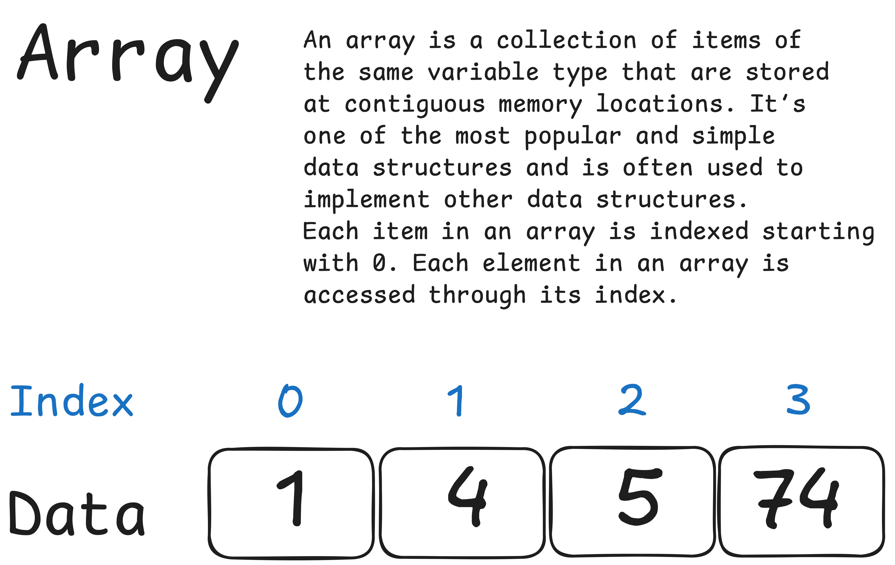

# Array

Массив — это простейшая и наиболее распространенная структура данных.
Другие структуры данных, например, стеки и очереди, производны от массивов.

---

Каждому элементу данных присваивается положительное числовое значение, 
именуемое индексом и соответствующее положению этого элемента в массиве. 
В большинстве языков программирования элементы в массиве нумеруются с 0.

## Сложность операций

|             | **Access** | **Search** | **Insertion** | **Deletion** |
|:------------|:----------:|:----------:|:-------------:|:------------:|
| **Average** |    O(1)    |    O(n)    |     O(n)      |     O(n)     |
| **Worst**   |    O(1)    |    O(n)    |     O(n)      |     O(n)     |

