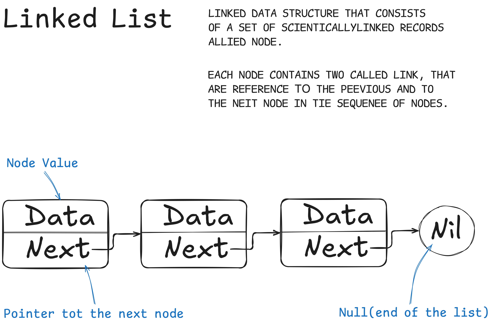

# Linked List

Связный список — еще одна важная линейная структура данных, на первый взгляд напоминающая массив. 
Однако, связный список отличается от массива по выделению памяти, внутренней структуре и по тому, 
как в нем выполняются базовые операции вставки и удаления.

При помощи связных списков реализуются файловые системы, хеш-таблицы и списки смежности.

---

Связный список напоминает цепочку узлов, в каждом из которых содержится информация: например, 
данные(data) и указатель на следующий узел в цепочке(next). Есть головной указатель, соответствующий 
первому элементу в связном списке, и, если список пуст, то он направлен просто на null (ничто).

## Сложность операций

|             | **Access** | **Search** | **Insertion** | **Deletion** |
|:------------|:----------:|:----------:|:-------------:|:------------:|
| **Average** |    O(n)    |    O(n)    |     O(1)      |     O(1)     |
| **Worst**   |    O(n)    |    O(n)    |     O(1)      |     O(1)     |

